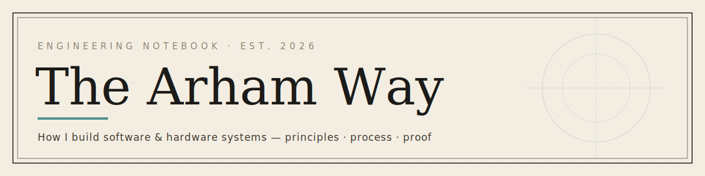
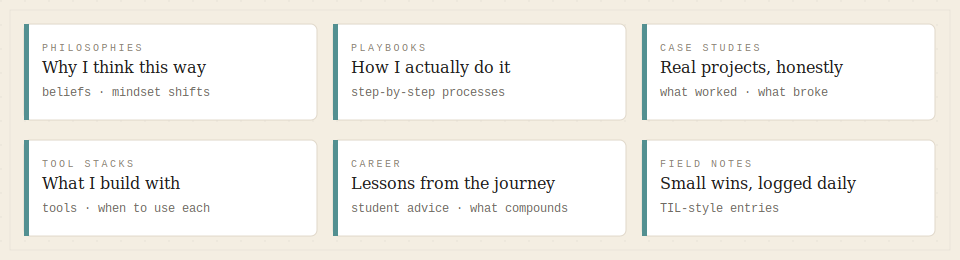

---

## Who I am

> My maternal uncle — we call him KB Mamo — is an Electronic Engineer.
> When I was a kid, he put a circuit board in my hands and showed me how it worked.
> Not *what* it did. *How* it worked.
>
> That was the moment I understood: **you can build anything you can imagine.**

I'm **Muhammad Arham Rajput** — a Computer Systems Engineering student at DUET Karachi. I chose CSE specifically to stay at that intersection KB Mamo showed me: where **software meets hardware**.

Right now I'm working as a full-stack developer, leading my university's engineering society, and building in the space of **Digital Twins · AI Hardware · Robotics**.

`📍 Karachi, Pakistan` &nbsp;·&nbsp; `🎓 DUET CSE 2027` &nbsp;·&nbsp; `🎸 Guitarist`

---

## What this repo is

I learn best by writing things down.

This is my working notebook — the principles I've developed, the processes I actually follow, and the real projects where I tested them. Not a portfolio. Honest documentation of an engineer in progress.

---

## Inside

| Folder | |
| :--- | :--- |
| [`philosophies/`](./philosophies) | The beliefs behind how I work |
| [`playbooks/`](./playbooks) | Repeatable processes, step by step |
| [`case-studies/`](./case-studies) | Real projects — what worked and what broke |
| [`tool-stacks/`](./tool-stacks) | The tools I use and how I choose them |
| [`career/`](./career) | Advice for students and juniors |
| [`field-notes/`](./field-notes) | Short entries, logged as I go |

---

## Start here

| | |
| :--- | :--- |
| [Why I work specs-first →](./philosophies/sdd-vs-vibe-coding.md) | My core engineering philosophy |
| [How I start any project →](./playbooks/the-blueprint-method.md) | Idea to shipped, step by step |
| [A real project, with the messy parts →](./case-studies/hsk-bone-care-migration.md) | HSK Bone Care: NoSQL → PostgreSQL |

---

## Find me

[LinkedIn](https://www.linkedin.com/in/muhammad-arham-rajput) &nbsp;·&nbsp;
[GitHub](https://github.com/Arhamurrahemeen) &nbsp;·&nbsp;
[Instagram](https://www.instagram.com/arham_urrahemeen/) &nbsp;·&nbsp;
[Email](mailto:business.arhamurrahemeen@gmail.com)

---

Living document — updated as I build and learn.

