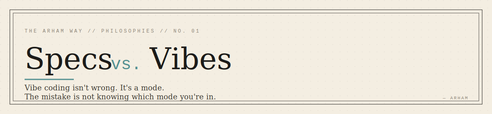
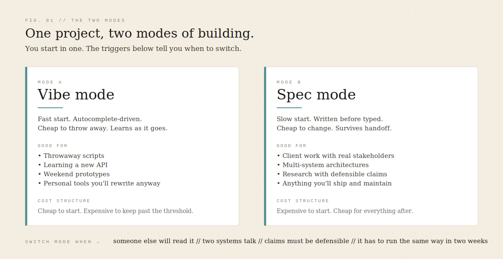
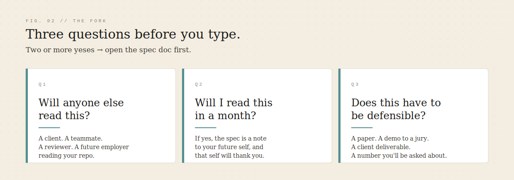

  

# Specs vs. Vibes

> Vibe coding isn't wrong. It's a mode.
> The mistake is not knowing which mode you're in.

I vibe-code all the time. When I'm learning a new API, I don't open a doc — I open a file, autocomplete a first line, and let the shape emerge. When I need a script to rename two hundred images before an event, I don't write a spec. I write the script.

Anyone who tells you vibe coding is a bug is selling you something. Usually a course.

But I've also shipped projects where vibes would have quietly killed the work — not with a bug, but by letting the scope grow until nothing was ever finished. The point of this piece isn't to pick a side. It's to name the two modes honestly and give you a way to tell which one you're in.

  

---

## The two modes

**Vibe mode.** Fast start. The code is the thinking. You type, the tool completes, you correct, it completes better. The feedback loop is seconds long. You accept that most of what you write is disposable, because writing it was cheap. This is a real engineering skill, not a shortcut. You can't spec your way into learning what a library actually does. You have to touch it.

**Spec mode.** Slow start. The thinking is written down before it's typed. A file — call it `blueprint.md`, call it whatever — that names what you're building, why, for whom, and what "done" looks like. You pay a cost upfront to make every later cost smaller. Changes are cheap because the spec is the argument, and the code is the implementation of the argument.

Neither mode is better. They have different cost structures. Vibe mode is cheap to start and expensive to keep. Spec mode is expensive to start and cheap for everything after.

The mistake isn't choosing the wrong mode. The mistake is starting a spec-mode project in vibe mode and not noticing until you're four hundred files deep in a codebase nobody — including you — can explain.

---

## Where vibes stop working

Vibes stop working at specific, nameable thresholds. Not "when the code gets big." Code doesn't care how big it is. The thresholds are about *who else has to understand it and when.*

- **Someone else has to read it.** A client. A teammate. A reviewer. The moment the code has to travel out of your head into another person's head, prose does that better than autocomplete.
- **Two systems talk to each other.** A frontend and a backend. A signal processor and a UI. A hardware sensor and a Python pipeline. The contract between them is the thing that breaks, and vibes don't write contracts.
- **The claims have to be defensible.** A research paper. A demo to a jury. A client deliverable. You'll be asked *why is it 0.7 Hz and not 0.5?* The answer has to exist somewhere, and it has to exist before the code, or you'll invent it after — which is worse than lying.
- **It has to run the same way in two weeks.** Weekend prototypes are allowed to be miracles. Anything you'll show, ship, or maintain has to be reproducible, and reproducibility starts with a spec.

Any *one* of these is a signal. Two of them is a certainty. If the project you're staring at hits two, close the editor and open a doc.

---

## HSK Bone Care — specs bought alignment

HSK Bone Care is a real client project. Full-stack. Non-technical stakeholder. The kind of build where the requirements don't come from a PRD — they come from a WhatsApp conversation, and they change three times before Friday.

If I had opened Cursor and started building, I would have shipped the wrong product. Not because I'd have written bad code, but because "bad code" isn't the failure mode of client work. The failure mode is *building the thing the client didn't mean when they said what they said.*

The spec was the contract. Not a legal contract — a shared document that said: here's what this screen does, here's what it doesn't do, here's what happens when someone taps this button. The client didn't read the whole thing. They didn't need to. They read the parts where we disagreed, and we resolved the disagreements in prose, in an afternoon, instead of in code, in a week.

The spec didn't buy me better software. It bought me a stakeholder who knew what they were getting. That's a different product.

---

## VitalSense — specs kept the research honest

VitalSense is a remote photoplethysmography project — measuring a heart rate from a webcam by tracking the tiny color changes in the skin of a forehead as blood moves through it. It's a Computer Systems Engineering student project, not a clinical device. But it's built on real signal processing, real DSP, and a small stack of research papers going back to Verkruysse's 2008 work.

Here is what "detect heart rate from a webcam" looks like without a spec:

> *It could use any face region. It could filter at any frequency. It could run at any frame rate. It could output BPM, or HRV, or SpO₂, or all three. It could have a dashboard, or a HUD, or a REST API. It could compare methods. It could add an AI layer.*

That project has no end. Every one of those "coulds" is a week. Some of them are a semester.

Here is what the spec pinned down before I wrote a line of pipeline code:

- **ROI:** anatomically stable forehead region, tracked with MediaPipe.
- **Signal:** raw green-channel mean, extracted per frame.
- **Filter:** 2nd-order SOS Butterworth bandpass, `0.7–4.0 Hz`.
- **Estimation:** FFT on the filtered signal, peak in the physiological band.
- **Runtime:** 30 FPS on a laptop CPU, asynchronous face tracking so the UI doesn't stall.

Every one of those numbers is a decision that stopped scope creep. `0.7 Hz` isn't arbitrary — that's 42 BPM, the low end of a resting human heart. `4.0 Hz` is 240 BPM, the high end of exertion. The bandpass isn't a filter choice, it's a *definition of what counts as a heartbeat.* Without the spec, that number lives in my head. With the spec, it lives in `VitalSenseV1.md`, and the code in `dsp_pipeline.py` implements it.

You can see the spec in the repo structure itself. `signal_extractor.py`, `dsp_pipeline.py`, `hrv.py`, `lighting.py`, `ai_feedback.py` — each file is a module the spec named before it was code. That modularity isn't a refactor. It's the shape the spec had first.

The spec didn't make the science better. It made the science *finishable.* And when the paper had to be written, the methodology section was mostly already there.

---

## The fork

  

Before you type, ask three questions:

1. **Will anyone else read this?**
2. **Will I read this in a month?**
3. **Does this have to be defensible?**

Zero yeses → vibe. It's a script, it's an experiment, it's a Friday night. Type.

One yes → your call. If it's cheap to redo, vibe. If it's expensive to redo, spec.

Two or more yeses → open the doc. Not the editor. Not yet.

The doc doesn't have to be long. A page. Sometimes half a page. The point isn't length — it's that the argument for what you're building exists in prose *before* it exists in code, so that when the code disagrees with the argument, you know which one is wrong.

---

## My current stack

> The method above is durable. The tools below are dated. This section will be wrong in two years.

- **Spec drafting:** Claude, in long-form. I write the first pass by hand, then argue with it until the doc is sharp.
- **Adversarial review:** Kimi AI. I hand it the spec and ask it to break things — edge cases, hidden assumptions, missing constraints.
- **Architecture sketch:** Excalidraw. One diagram, on paper if possible, before any file structure gets committed.
- **Execution:** Cursor. Vibe mode is fine *here* — because the spec above it is doing the load-bearing work.

That last line is the point. Vibe coding *inside* a spec is safe. Vibe coding *instead of* a spec is what people mean when they warn you off it.

---

Know which mode you're in. Then commit to it.

Build the next thing.

— Arham
