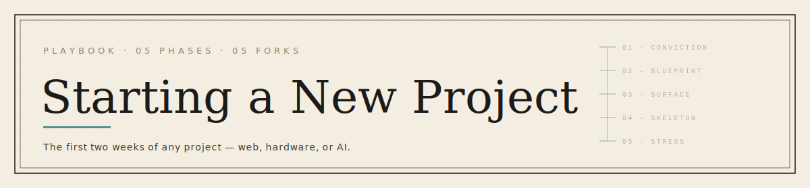
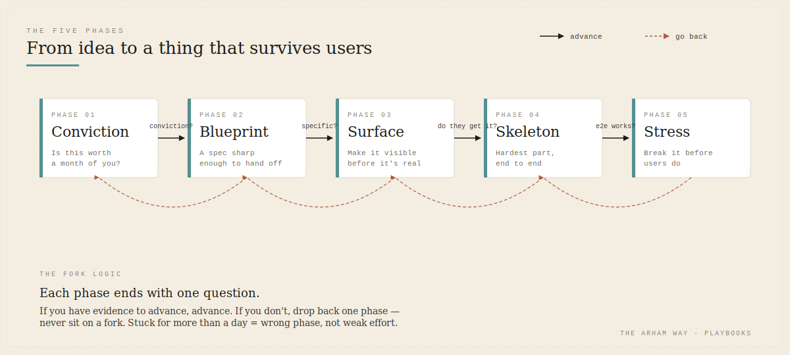
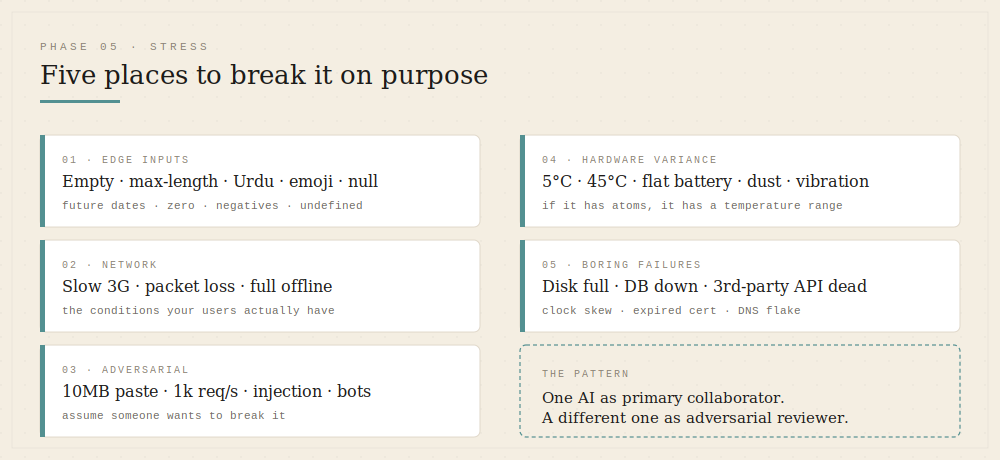

  

# Starting a New Project

> A phased playbook for the first two weeks of any new project — web, hardware, AI, or a mix.
> The phases don't change. The tools and depth do.

---

## Why this playbook exists

Most new projects die in the first two weeks. Not because the idea was bad, but because the builder rushed past the questions that decide whether the project is worth building at all. By the time the codebase has fifty files, those questions are expensive to answer.

This is the sequence I run through before I let myself open an editor. It works the same whether I'm building a Postgres-heavy SaaS, a Raspberry Pi computer-vision rig, or an agentic AI system. The deliverables shift; the phases hold.

There are five phases, and at each one there's a fork. The fork is the point — knowing *when* to commit to a path matters more than which tool you reach for inside it.

  

---

## Phase 1 — Conviction

**Goal:** decide whether this project deserves your next month.

Before tools, before specs, before sketches: you write down — in plain prose, no jargon — what you're building, who it's for, and why it has to exist. If you can't do this in a paragraph, you don't understand the project yet. That's fine; it just means the work right now is thinking, not making.

I write three things on paper at this stage:

1. **The one-sentence pitch.** "It's a *<thing>* for *<person>* that *<does X better than current option>*."
2. **The honest "why me."** What do I know, have, or have access to that makes this less stupid for me to attempt than for a random builder?
3. **The kill criteria.** What would I have to learn in the next two weeks for me to drop this without ego?

> **Fork:** Can you write all three without hedging?
> **Yes →** Go to Phase 2.
> **No →** Don't open the laptop. Talk to one person in the target audience first. Conviction borrowed from your own enthusiasm is the most expensive borrowing there is.

---

## Phase 2 — Blueprint

**Goal:** turn the idea into a spec dense enough that a stranger could build a v0 from it.

This is where I use Claude. Not to generate the spec *for* me — to argue with me until the spec is sharp. I open a long-form chat and walk through:

- The user's actual day, hour by hour, around the moment the product enters their life
- The data model: every entity, every relationship, every lifecycle state
- The non-functional requirements I keep skipping (latency budget, offline behaviour, what happens when the network dies — non-negotiable in Pakistan)
- The smallest possible v1 that still solves the real problem

The output is a single markdown file — `blueprint.md` — that lives in the repo root from day one. It is the source of truth. Every tool downstream consumes it.

If the project has hardware or physical components, this is also where I sketch the system on paper or in Excalidraw: power flow, data flow, mechanical envelope. AI alone is bad at the physical world; a 5-minute sketch beats a 2-hour back-and-forth.

> **Fork:** Is the blueprint specific enough that two engineers given it independently would build roughly the same thing?
> **Yes →** Go to Phase 3.
> **No →** Stay here. Vague blueprints become expensive bugs by week three.

---

## Phase 3 — Surface

**Goal:** make the thing visible before it's real.

For a software project, this is UI. For hardware, it's a rough enclosure sketch and a wiring diagram. For an AI system, it's a sample input/output pair and the prompt that connects them. The point is the same: produce an artifact a non-builder can react to.

My stack for this phase:

- **Google Stitch** for first-pass UI mockups from the blueprint
- **Figma** for the second pass once Stitch gets the structure roughly right
- **Excalidraw** for system diagrams, data flow, and hardware layouts
- **A real notebook** for anything mechanical or spatial — paper is still faster than software for this

The artifact at the end of Phase 3 is something you can put in front of a non-technical person — a friend, a target user, your mom — and get a real reaction to. If their reaction is "what is this," you go back to Phase 2. If it's "okay but why would I use it instead of X," you go back to Phase 1.

> **Fork:** Did anyone outside your head see the mockup and *get it* without you explaining?
> **Yes →** Go to Phase 4.
> **No →** Refine the surface or revisit the blueprint. Don't write code to fix a comprehension problem.

---

## Phase 4 — Skeleton

**Goal:** stand up the smallest end-to-end version that proves the hardest part works.

Note: end-to-end, not feature-complete. If the hardest part of the project is real-time sync, the skeleton is two clients syncing one field. If the hardest part is an ML model's accuracy on local data, the skeleton is the model running on five real samples. If it's hardware, it's the sensor reading a value and that value reaching a screen.

This is where Cursor and VS Code earn their place. With the blueprint loaded into context, the in-editor agent does the boilerplate honestly fast — scaffolding, routing, database connections, the dull setup work that used to eat the first three days. I still write the parts that involve judgment: the data model, the core algorithm, the bits I'd be embarrassed not to understand.

Two rules I keep at this phase:

1. **No second feature until the first one is end-to-end deployable.** Local-only doesn't count.
2. **Every file gets a top comment linking back to the section of `blueprint.md` it implements.** Future me thanks present me weekly for this.

> **Fork:** Does the skeleton actually work end-to-end, including the hardest part?
> **Yes →** Go to Phase 5.
> **No →** Don't add features. Make the skeleton walk first.

---

## Phase 5 — Stress

**Goal:** break it on purpose before users do.

This is the phase most builders skip, and it's where I've started leaning on Kimi for second-opinion reviews. The pattern is: I describe what the skeleton does and what I think the failure modes are, and I ask Kimi to find the ones I missed. A second model with a different training distribution catches different edge cases — and that's the entire point. One AI as primary collaborator, a different one as adversarial reviewer.

  

What I check at this phase:

- **Edge inputs.** Empty strings, max-length strings, Urdu text, emojis, null, undefined, future dates, past dates, zero, negative numbers
- **Network conditions.** Slow 3G, intermittent loss, full offline — the conditions a lot of my users actually have
- **Adversarial inputs.** What happens if someone pastes 10MB of garbage into the form? What if they hit the API a thousand times a second?
- **Hardware variance.** If there's physical hardware, what happens at 5°C? At 45°C? With a flat battery? With dust?
- **The boring failures.** Disk full, DB connection lost, third-party API down, clock skew

Anything that breaks the skeleton, I write down as an issue. Anything I *can't* break, I write down as a tested invariant. Both lists go into the repo.

> **Fork:** Have you tried, in good faith, to break this — and either fixed it or documented why the failure is acceptable?
> **Yes →** You're past starting. Begin Phase 6 (which is just normal product work).
> **No →** One more day of stress. Future bugs are cheaper to fix now than after the next phase of features.

---

## The prompt I paste at the top of the reviewer chat

A second model only earns its place if you tell it to behave differently from the first one. Left to defaults, Kimi will agree with me as eagerly as Claude does — which is useless for stress-testing. So before I describe the skeleton, I paste a short prompt that resets the relationship.

The seven rules I run with:

1. **You are not my assistant. You are my advisor who happens to be smarter than me.** Defaults skew toward agreement; this line resets the gradient.
2. **First sentence challenges an assumption, names a gap, or asks the question I haven't asked.** No openers, no warm-up.
3. **Tag every claim** — `[Certain]` with hard evidence, `[Likely]` for strong inference, `[Guessing]` when filling gaps. If most of the reply is guessing, say so up front.
4. **Kill the filler.** No "great question," no "you're absolutely right," no "that makes a lot of sense." If you catch yourself typing one, delete and rewrite.
5. **Disagree with structure.** When I'm wrong: "I disagree because *<reason>*. Here's what I'd do instead: *<alternative>*. The risk in your approach is *<specific downside>*."
6. **Lead with the uncomfortable answer.** If there's a truth I probably don't want to hear, it goes in the first line — not buried in paragraph three.
7. **If I push back, hold the position** unless I give you genuinely new information. *"But I really think"* is not new information.

I paste this as a single message at the top of a fresh chat, then describe the skeleton. Two things happen the first reply: the model leads with the thing I didn't want to hear, and it stops sounding like it's auditioning for my approval. That's the signal the prompt landed.

> **The pattern, restated:** one AI as primary collaborator, a different one as adversarial reviewer — and the reviewer needs a prompt sharper than the assistant does. The default mode of every chatbot is to agree. Stress-testing is the one phase where that default is the bug.

---

## The decision philosophy underneath

If you re-read the forks, you'll notice they're all the same shape: *do you have the evidence to advance, or are you advancing on enthusiasm?* Conviction, specificity, comprehension, end-to-end function, durability. Each fork is a place to slow down on purpose.

The reason this works the same across hardware, AI, and web is that the failure modes are the same. Projects don't die from bad code. They die from skipped questions, vague specs, invisible surfaces, fragile skeletons, and untested assumptions. The tools above are interchangeable — I'll be using different ones in a year. The forks won't change.

---

## My current stack at each phase

| Phase | What I reach for first |
|---|---|
| Conviction | Pen, paper, a walk |
| Blueprint | Claude (long-form), Excalidraw for diagrams |
| Surface | Google Stitch → Figma, paper for physical/spatial |
| Skeleton | Cursor / VS Code with the blueprint in context |
| Stress | Kimi as adversarial reviewer, plus my own checklist |

I publish the stack separately in [`tool-stacks/the-ai-orchestrator.md`](../tool-stacks/the-ai-orchestrator.md) because it dates faster than the method does.

---

## What this playbook is not

It is not an excuse to spend three weeks in Phase 2. Specs that never ship are just expensive journaling. The forks exist to keep you moving — each one ends with "advance" or "go back one step," never "stay here forever." If you're stuck at a fork for more than a day, the answer is usually to go back one phase, not to push harder on the current one.

Build the next thing.

— Arham
