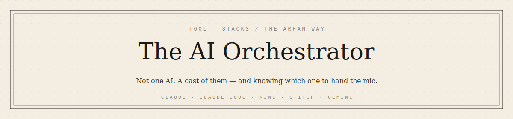
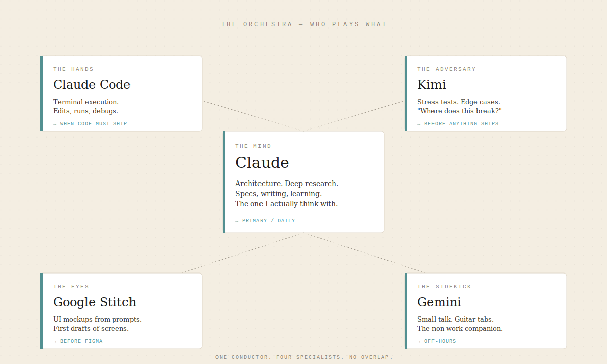

  

# The AI Orchestrator

> How I split work across AI tools without letting any one of them run the whole show.
> The roles don't change. The tools filling them will.

Most people I talk to are still looking for **the** AI — the single tool that will do everything. Pick the best model, commit to it, done.

That framing is wrong.

The interesting question isn't *which AI is best*. It's *what role does this piece of work need, and who plays that role well?* A codebase doesn't need one engineer who does everything mediocre — it needs a small team where each person is sharp at one thing. My AI stack works the same way. There's a mind, there's a pair of hands, there's an adversary who tries to break what the mind produced, there's someone who sketches screens, and there's a sidekick for the hours when I'm not working.

Five roles. Different tools filling each. I switch between them the same way I'd switch between people on a project — by asking what the work actually needs next.

  

---

## 1. The Mind — Claude

**Goal:** think with me. Not for me.

Claude is where the real work happens. Architecture, deep research, spec writing, case studies, the writing you're reading right now — all of it goes through Claude first. It's the only tool in the stack I trust with long context and ambiguous problems.

What I actually use it for:

- **Architecture and specs.** Before a single file gets created, the system gets talked through with Claude. Constraints, forks, trade-offs, edge cases surfaced *before* code exists to defend.
- **Deep research.** When I need to understand a new domain — rPPG for VitalSense, OpenMPI for MiniHPC, agentic patterns for PIAIC coursework — Claude is the reading partner. It doesn't just summarize; it lets me interrogate the material.
- **Repo writing.** Every piece in The Arham Way is drafted with Claude. `CONTEXT.md` lives in the project so voice stays consistent across sessions.
- **Learning.** Whenever a concept won't click, I explain it back to Claude and let it catch what I got wrong.

Claude doesn't get treated like a search engine. It gets treated like the smartest engineer I know who happens to have infinite patience for my half-formed ideas.

> **Fork:** Is the problem ambiguous, long-context, or judgment-heavy?
> **Yes →** Claude.
> **No →** Something further down this list.

---

## 2. The Hands — Claude Code

**Goal:** execute. Fast, in the terminal, with the repo already loaded.

Once the thinking is done, Claude Code takes over. This is the tool that actually touches files, runs commands, and debugs.

The split with Claude (chat) matters. Chat Claude is where I decide *what* to build. Claude Code is where I build it. Trying to do architecture inside Claude Code is like trying to draw blueprints while pouring concrete — the tool is optimized for the wrong phase.

What I hand to Claude Code:

- Implementing a spec that's already agreed on
- Reading through an unfamiliar codebase and explaining the flow
- Debugging a failing test or a stack trace
- Refactoring across many files where I know the target shape
- Wiring up boilerplate that isn't worth thinking about

The rule: **if I can't describe what "done" looks like in one sentence, it's not a Claude Code task yet.** It's a Claude (chat) task that hasn't finished cooking.

---

## 3. The Adversary — Kimi

**Goal:** try to break what the mind just built.

Everything Claude produces has one problem: Claude is agreeable. It's a genuinely good thinking partner but it doesn't fight me hard enough. That's a real gap when the work is a spec, an architecture, a case study — anything that needs to survive contact with a hostile reader.

Kimi fills that gap.

I hand Kimi finished drafts with a prompt that reads roughly: *"You are an adversarial reviewer. Find every weak claim, every unhandled edge case, every place where the reasoning skips a step. Be blunt."* Then I let it tear the thing apart.

This isn't a "second opinion" step. It's a formal phase in my methodology. If a spec hasn't been through adversarial review, it isn't finished — it's just a first draft that hasn't been caught yet.

What Kimi gets used for:

- Stress-testing project specs before code starts
- Edge cases on architecture decisions
- Reviewing case studies for weak claims or missing evidence
- Playing devil's advocate on career and content decisions

Kimi is better than Gemini at this specific job. Sharper pushback, less hedging, less "on the other hand" softness. That's the whole reason it's in the stack.

> **Fork:** Am I about to ship or commit to this?
> **Yes →** Adversarial pass with Kimi first.
> **No →** Keep drafting in Claude.

---

## 4. The Eyes — Google Stitch

**Goal:** turn a UI idea into a screen I can actually look at.

Design happens in stages. Before Figma, before pixel-pushing, I need to *see* the thing. Stitch handles that.

I describe the screen — the purpose, the audience, the constraints (mobile-first, Urdu support, low-bandwidth) — and Stitch produces a first draft I can react to. Reacting to something concrete is ten times faster than describing something imaginary.

From Stitch, the flow is:

1. Prompt Stitch → get first-draft screens
2. Pull the good ones into Figma
3. Refine against the design system (cream / ink / teal / muted — the same palette used across everything I ship)
4. Hand the final to Claude Code for implementation

Stitch doesn't replace Figma. It replaces the blank canvas.

---

## 5. The Sidekick — Gemini

**Goal:** be there for the non-work hours.

Gemini is the one tool in this stack that isn't in the critical path for shipping anything. It's for the rest of life.

- Guitar. Chord progressions, tabs, figuring out what key a song is in, breaking down a solo. Gemini is genuinely good at music stuff.
- General conversation when I want to talk through something that isn't engineering.
- Quick lookups where I don't need Claude's depth.

It's not that Gemini is bad at technical work — it's that I already have three tools sharper at each specific engineering job. Gemini's slot in my life is the after-hours slot, and it earns it.

If it ever stops being useful at guitar, it drops out of the stack. Role-first, remember.

---

## 6. How the Baton Passes

The whole point of the orchestra frame is that no single tool owns a project end-to-end. Work moves between them in a specific order:

1. **Claude** — talk through the problem, write the spec, decide the architecture
2. **Kimi** — adversarial review of the spec. Fix the holes.
3. **Google Stitch → Figma** — if there's a UI, sketch and refine
4. **Claude Code** — implement against the spec
5. **Kimi again** — adversarial review of the final artifact before it ships
6. **Claude** — write the case study, the LinkedIn post, the field note

The mistake I used to make was letting one tool stretch into a role it wasn't good at. Asking Claude Code to help me decide the architecture. Asking Gemini to review a spec. Asking Claude to be its own adversary. Each of those turns out mediocre work because the tool is being used for the wrong job.

The fix isn't finding a better tool. It's respecting the role split.

---

## 7. The Stack, in a Table

| Role | Tool | What it does | When I reach for it |
|---|---|---|---|
| The Mind | **Claude** | Architecture, deep research, writing, learning | Anything ambiguous, long-context, or judgment-heavy |
| The Hands | **Claude Code** | Terminal execution, edits, debugging | When "done" fits in one sentence |
| The Adversary | **Kimi** | Stress tests, edge cases, blunt review | Before anything commits or ships |
| The Eyes | **Google Stitch** | First-draft UI screens | Before Figma. Kills the blank canvas. |
| The Sidekick | **Gemini** | Guitar, chords, small talk, quick lookups | Off-hours. Non-critical. |

The tools in this table will change. Claude will get better. Kimi might get replaced by something with sharper pushback. Stitch might get merged into Figma directly. Gemini might stop being the best at music.

**None of that matters.** The five roles stay. When a tool falls out, the question isn't *"what's the new best AI?"* — it's *"who's playing the mind now? Who's the adversary?"*

Fill the seats, not the brand names.

---

## 8. What This Isn't

**It isn't a benchmark table.** I'm not claiming Claude is objectively smarter than Gemini or Kimi is objectively better at code review. This is how *my* work splits, given how I actually think and ship.

**It isn't tool loyalty.** I moved most of my work to Claude because it fits how I think, not because I owe anyone anything. The day something plays the mind role better, it takes the seat.

**It isn't a full-agent workflow.** I don't run autonomous agents that chain these together. The orchestrator is me. The tools are the section leads. That's on purpose — the judgment about *which role the work needs next* is the highest-leverage decision, and I don't want to hand that off yet.

---

Pick the role first. Pick the tool second.

The rest is just typing.

— Arham
